# SARN: Inference

Quantifiers and monotonicity (and opposite adjectives) in reasoning tasks

## Setup

```sh
python3 -m venv .venv
source .venv/bin/activate
pip install -r requirements.txt
```

## Usage

```sh
source .venv/bin/activate
# Finetuning
python -m sarn.train --output-dir models/bart-mq --log-dir logs/bart-mq facebook/bart-large-mnli data/training.csv
# Inference of two sequences (forwards)
python -m sarn.classify --model models/bart-mq "All dogs jumped over the fence." "Some small dogs jumped over the fence."
# ROC curve (SVG and PDF diagram)
python -m sarn.roc microsoft/deberta-large-mnli data/evaluation.csv
# Model accuracy on dataset
python -m sarn.accuracy models/deberta-mq data/evaluation.csv
# Dataset statistics
python -m sarn.stats data/training.csv
# Language Interpretability Tool
python -m sarn.lit \
  --models "facebook/bart-large-mnli" \
           "microsoft/deberta-large-mnli" \
           "./models/bart-mq" \
           "./models/deberta-mq" \
           "./models/bart-adj" \
           "./models/deberta-adj" \
  --datasets "./data/evaluation.csv" "./data/evaluation-adj.csv" \
  --cache_dir=cache_dir
```

As model, any valid [Huggingface model](https://huggingface.co/transformers/pretrained_models.html) (local or remote) can be specified that has been [finetuned for sequence classification](https://huggingface.co/models?pipeline_tag=text-classification), e.g., [`facebook/bart-large-mnli`](https://huggingface.co/facebook/bart-large-mnli), [`microsoft/deberta-large-mnli`](https://huggingface.co/microsoft/deberta-large-mnli) or a local path like `models/bart-mq`.

## Tips

### Download Models from CoLi Servers

```
# export COLI_USER=<your name>
scp -r ${COLI_USER:?}@last.cl.uni-heidelberg.de:/mnt/semproj/sem_proj20/proj1/models .
```

### Check if labels do not have typos in datasets

```sh
for i in ./data/*.csv; do
  python3 -m sarn.validate_datasets "$i"
done
```

## Datasets

See [`data/README.md`](data/README.md) for more information.

- `data/training.csv`: Training dataset for quantifiers and monotonicity in reasoning tasks
- `data/evaluation.csv`: Evaluation dataset for quantifiers and monotonicity in reasoning tasks
- `data/training.csv`: Training dataset for quantifiers and monotonicity in reasoning tasks with opposite adjectives
- `data/evaluation.csv`: Evaluation dataset for quantifiers and monotonicity in reasoning tasks with opposite adjectives

### Creating the datasets

```sh
source .venv/bin/activate

# data/training.csv
wget https://github.com/verypluming/MED/raw/master/MED.tsv
python -m sarn.convert.med
wget https://github.com/verypluming/HELP/raw/master/output_en/pmb_train_v1.0.tsv
python -m sarn.convert.help
cat data/med.csv data/help.csv > data/training.csv

# data/evaluation.csv
wget https://nlp.stanford.edu/~wcmac/downloads/fracas.xml
python -m sarn.convert.fracas
wget -O diagnostic-full.tsv https://www.dropbox.com/s/ju7d95ifb072q9f/diagnostic-full.tsv?dl=1
python -m sarn.convert.superglue
cat data/fracas.csv data/superglue.csv > data/evaluation.csv

# data/training-adj.csv
wget https://github.com/verypluming/MED/raw/master/MED.tsv
python -m sarn.convert.med_adjectives
# manual step here (you may modify sentences where it makes sense):
# - label data/med_adjectives_1.csv by hand (third column)
# - label data/med_adjectives_2.csv by hand (third column)
# - remove fourth column in both files
wget https://nlp.stanford.edu/~wcmac/downloads/fracas.xml
python -m sarn.convert.fracas_adjectives
cat data/med_adjectives_1.csv data/med_adjectives_2.csv data/fracas_adjectives.csv > data/training-adj.csv
python -m sarn.validate_datasets data/training-adj.csv

# data/evaluation-adj.csv
python -m sarn.convert.evaluation_adjectives
# manual step here (you may modify sentences where it makes sense):
# - label data/evaluation-adj.csv by hand (third column)
# - remove fourth column
python -m sarn.validate_datasets data/evaluation-adj.csv
```

### Dataset statistics

#### Character length

| Dataset                   | avg    | median | min | max |
| ------------------------- | ------ | ------ | --- | --- |
| `data/training.csv`       |
| Premises                  | 48.26  | 41     | 5   | 478 |
| Hypotheses                | 48.93  | 42     | 5   | 478 |
| `data/evaluation.csv`     |
| Premises                  | 79.84  | 58     | 26  | 206 |
| Hypotheses                | 61.57  | 50     | 26  | 186 |
| `data/training-adj.csv`   |
| Premises                  | 48.93  | 44     | 14  | 212 |
| Hypotheses                | 50.78  | 46     | 18  | 210 |
| `data/evaluation-adj.csv` |
| Premises                  | 100.19 | 83     | 25  | 189 |
| Hypotheses                | 86.62  | 69     | 35  | 189 |

#### Word length

| Dataset                   | avg   | median | min | max |
| ------------------------- | ----- | ------ | --- | --- |
| `data/training.csv`       |
| Premises                  | 9.98  | 9      | 2   | 83  |
| Hypotheses                | 10.10 | 9      | 2   | 83  |
| `data/evaluation.csv`     |
| Premises                  | 13.03 | 10     | 5   | 34  |
| Hypotheses                | 10.14 | 9      | 5   | 30  |
| `data/training-adj.csv`   |
| Premises                  | 8.89  | 8      | 3   | 29  |
| Hypotheses                | 9.18  | 9      | 3   | 29  |
| `data/evaluation-adj.csv` |
| Premises                  | 15.44 | 12     | 5   | 31  |
| Hypotheses                | 13.47 | 11     | 5   | 31  |

#### Labels

| Dataset                   | total  | contradiction | neutral         | entailment      |
| ------------------------- | ------ | ------------- | --------------- | --------------- |
| `data/training.csv`       | 41'273 | 0 (0.00%)     | 20'699 (50.15%) | 20'574 (49.85%) |
| `data/evaluation.csv`     | 118    | 15 (12.71%)   | 52 (44.07%)     | 51 (43.22%)     |
| `data/training-adj.csv`   | 1'206  | 420 (34.83%)  | 749 (62.11%)    | 37 (3.07%)      |
| `data/evaluation-adj.csv` | 144    | 47 (32.64%)   | 84 (58.33%)     | 13 (9.03%)      |

## Models

- [`facebook/bart-large-mnli`](https://huggingface.co/facebook/bart-large-mnli): Pretrained model of [BART](https://arxiv.org/abs/1910.13461) finetuned on [MultiNLI](https://cims.nyu.edu/~sbowman/multinli/)
- [`microsoft/deberta-large-mnli`](https://huggingface.co/microsoft/deberta-large-mnli): Pretrained model of [DeBERTa](https://arxiv.org/abs/2006.03654) finetuned on [MultiNLI](https://cims.nyu.edu/~sbowman/multinli/)
- `models/bart-mq`: finetuned version of `facebook/bart-large-mnli` on `data/training.csv`
- `models/deberta-mq`: finetuned version of `microsoft/deberta-large-mnli` on `data/training.csv`
- `models/bart-adj`: finetuned version of `models/bart-mq` on `data/training-adj.csv`
- `models/deberta-adj`: finetuned version of `models/deberta-mq` on `data/training-adj.csv`

### Creating the models

```sh
source .venv/bin/activate

# facebook/bart-large-mnli and microsoft/deberta-large-mnli will automatically
# be downloaded from huggingface.co when used

# models/bart-mq
python -m sarn.train --output-dir "models/bart-mq" --log-dir "logs/bart-mq" "facebook/bart-large-mnli" "data/training.csv"

# models/deberta-mq
python -m sarn.train --output-dir "models/deberta-mq" --log-dir "logs/deberta-mq" "microsoft/deberta-large-mnli" "data/training.csv"

# models/bart-adj
python -m sarn.train --output-dir "models/bart-adj" --log-dir "logs/bart-adj" "facebook/bart-large-mnli" "data/training-adj.csv"

# models/deberta-adj
python -m sarn.train --output-dir "models/deberta-adj" --log-dir "logs/deberta-adj" "microsoft/deberta-large-mnli" "data/training-adj.csv"
```

### Model statistics

#### Accuracy

| Model                          | `data/evaluation.csv` | `data/evaluation-adj.csv` |
| ------------------------------ | --------------------- | ------------------------- |
| `facebook/bart-large-mnli`     | 65.25%                | 40.97%                    |
| `microsoft/deberta-large-mnli` | 71.19%                | 47.22%                    |
| `models/bart-mq`               | 57.63%                | 34.72%                    |
| `models/deberta-mq`            | 61.86%                | 34.72%                    |
| `models/bart-adj`              | 45.76%                | 58.33%                    |
| `models/deberta-adj`           | 42.37%                | 57.64%                    |

#### ROC curves

> An ROC curve (receiver operating characteristic curve) is a graph showing the performance of a classification model at all classification thresholds.
> [...]
> AUC stands for "Area under the ROC Curve." That is, AUC measures the entire two-dimensional area underneath the entire ROC curve (think integral calculus) from (0,0) to (1,1).
> [...]
> AUC provides an aggregate measure of performance across all possible classification thresholds. One way of interpreting AUC is as the probability that the model ranks a random positive example more highly than a random negative example.
>
> &mdash; <cite>[Google Machine Learning Crash Course](https://developers.google.com/machine-learning/crash-course/classification/roc-and-auc)</cite>

| BART                                                                   | DeBERTa                                                                    |
| ---------------------------------------------------------------------- | -------------------------------------------------------------------------- |
| 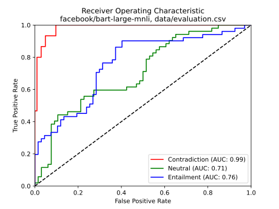     | 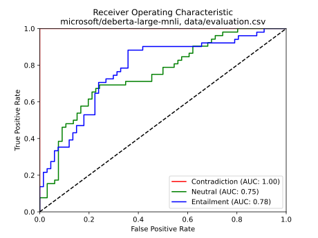     |
| 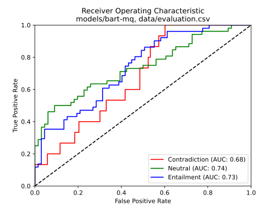               | 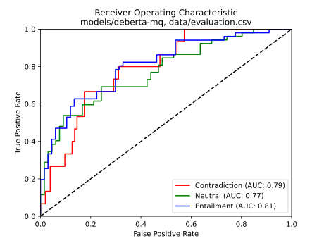                |
| 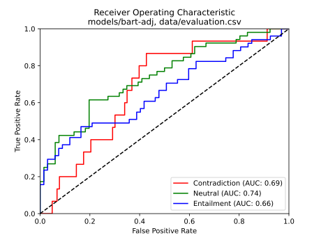              | 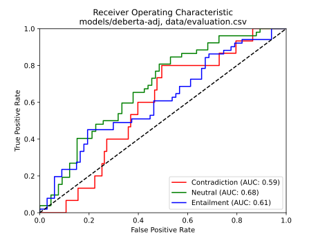               |
| 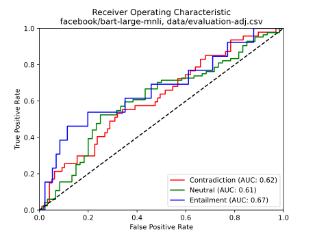 | 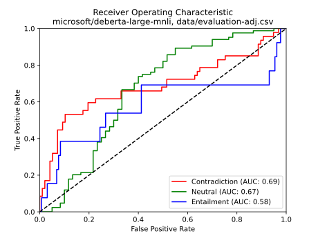 |
| 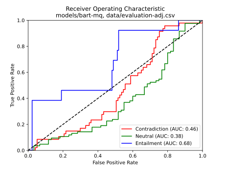           | 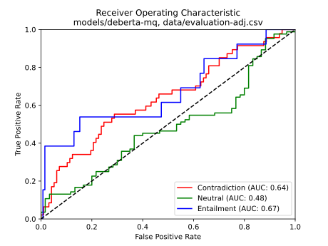            |
| 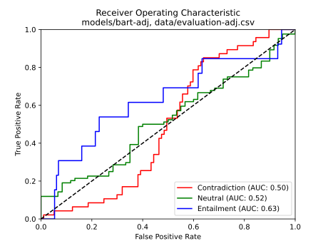          | 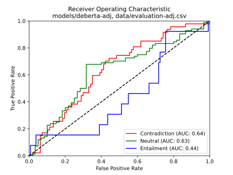           |
