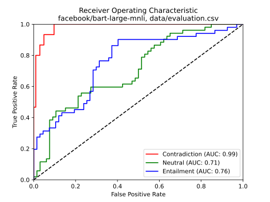
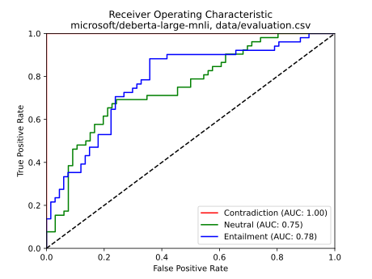
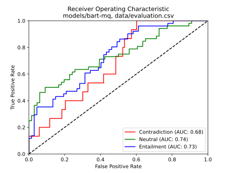
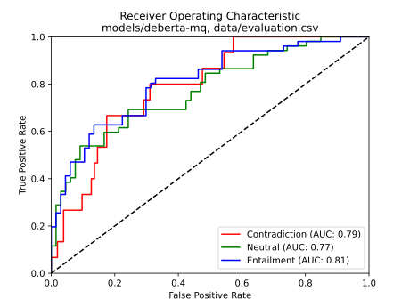

# inference

Quantifiers and monotonicity in reasoning tasks

## Setup

```sh
python3 -m venv .venv
source .venv/bin/activate
pip install -r requirements.txt
```

## Usage

```sh
source .venv/bin/activate
# Finetuning
python -m sarn.train --output-dir models/bart-mq --log-dir logs/bart-mq facebook/bart-large-mnli data/training.csv
# Inference of two sequences (forwards)
python -m sarn.classify --model models/bart-mq "All dogs jumped over the fence." "Some small dogs jumped over the fence."
# ROC curve (SVG and PDF diagram)
python -m sarn.roc microsoft/deberta-large-mnli data/evaluation.csv
# Model accuracy on dataset
python -m sarn.accuracy models/deberta-mq data/evaluation.csv
# Dataset statistics
python -m sarn.stats data/training.csv
# Language Interpretability Tool
python -m lit.main \
  --models "./models/deberta-mq" \
           "./models/bart-mq" \
           "facebook/bart-large-mnli" \
           "microsoft/deberta-large-mnli" \
  --datasets "./data/evaluation.csv" "./data/training.csv" \
  --cache_dir=cache_dir
```

As model, any valid [Huggingface model](https://huggingface.co/transformers/pretrained_models.html) (local or remote) can be specified that has been [finetuned for sequence classification](https://huggingface.co/models?pipeline_tag=text-classification), e.g., [`facebook/bart-large-mnli`](https://huggingface.co/facebook/bart-large-mnli), [`microsoft/deberta-large-mnli`](https://huggingface.co/microsoft/deberta-large-mnli) or a local path like `models/bart-mq`.

## Usage - LIT

```sh
source .venv/bin/activate
```

## Tips

### Download Models from CoLi Servers

```
# export COLI_USER=<your name>
scp -r ${COLI_USER:?}@last.cl.uni-heidelberg.de:/mnt/semproj/sem_proj20/proj1/models .
```

## Statistics

### Dataset statistics

#### Character length

| Dataset                   | avg   | median | min | max |
| ------------------------- | ----- | ------ | --- | --- |
| `data/training.csv`       |
| Premises                  | 48.26 | 41     | 5   | 478 |
| Hypotheses                | 48.93 | 42     | 5   | 478 |
| `data/evaluation.csv`     |
| Premises                  | 79.84 | 58     | 26  | 206 |
| Hypotheses                | 61.57 | 50     | 26  | 186 |
| `data/training-adj.csv`   |
| Premises                  |       |        |     |     |
| Hypotheses                |       |        |     |     |
| `data/evaluation-adj.csv` |
| Premises                  |       |        |     |     |
| Hypotheses                |       |        |     |     |

#### Word length

| Dataset                   | avg   | median | min | max |
| ------------------------- | ----- | ------ | --- | --- |
| `data/training.csv`       |
| Premises                  | 9.98  | 9      | 2   | 83  |
| Hypotheses                | 10.10 | 9      | 2   | 83  |
| `data/evaluation.csv`     |
| Premises                  | 13.03 | 10     | 5   | 34  |
| Hypotheses                | 10.14 | 9      | 5   | 30  |
| `data/training-adj.csv`   |
| Premises                  |       |        |     |     |
| Hypotheses                |       |        |     |     |
| `data/evaluation-adj.csv` |
| Premises                  |       |        |     |     |
| Hypotheses                |       |        |     |     |

#### Labels

| Dataset                   | total  | contradiction | neutral         | entailment      |
| ------------------------- | ------ | ------------- | --------------- | --------------- |
| `data/training.csv`       | 41'273 | 0 (0.00%)     | 20'699 (50.15%) | 20'574 (49.85%) |
| `data/evaluation.csv`     | 118    | 15 (12.71%)   | 52 (44.07%)     | 51 (43.22%)     |
| `data/training-adj.csv`   |        |               |                 |                 |
| `data/evaluation-adj.csv` |        |               |                 |                 |

### Model statistics

#### Accuracy

| Model                          | `data/evaluation.csv` | `data/evaluation-adj.csv` |
| ------------------------------ | --------------------- | ------------------------- |
| `facebook/bart-large-mnli`     | 65.25%                |                           |
| `microsoft/deberta-large-mnli` | 71.19%                |                           |
| `models/bart-mq`               | 57.63%                |                           |
| `models/deberta-mq`            | 61.86%                |                           |
| `models/bart-adj`              |                       |                           |
| `models/deberta-adj`           |                       |                           |

#### ROC curves

| BART                                                               | DeBERTa                                                                |
| ------------------------------------------------------------------ | ---------------------------------------------------------------------- |
|  |  |
|            |             |
